# Seata

## 基础概念

### 概念：

#### CAP

分布式系统 无法同时满足CAP这三个指标

- C：一致性
  用户访问分布式系统中的任意一个节点 得到的数据必须一致
- A：可用性
  用户访问集群中的任意健康节点 必须能得到相应 而不是超时拒绝
- P：分区容错性
  因为网络或其他原因导致分布式系统中的部分节点 与其他节点失去连接 形成独立分区
  在系统出现分区时 整个系统也要持续对外提供服务

分区问题大概率是会出现的 所以分区容错性几乎是所有分布式系统都必须保证的

#### BASE

base理论时对cap的以重解决思路 包含三个思想

- 基本可用：分布式系统在出现故障时 可以牺牲部分可用性 保证核心可用
- 软状态：在一定时间内 允许出现中间状态 比如临时的不一致状态
- 最终一致性：虽然无法保证强一致性 但是在软状态结束后 最终达到数据一致

#### 模型

- AP模型：各子事务分别执行和提交 允许出现结果不一致
  然后采用弥补措施恢复数据即可 实现最终一致
- CP模式：各个子事务执行后互相等待 同时提交 同时回滚 达成强一致
  但事务等待过程中 处于弱可用状态

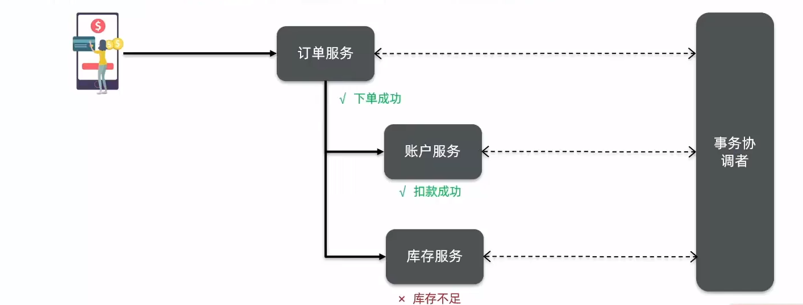

#### 角色

- TC - 事务协调者：维护全局和分支事务的状态 协调全局事务的提交和回滚 （TC是一个单独的服务）

- TM - 事务管理器：定义全局事务的范围、开始全局事务、提交或回滚全局事务

- RM - 资源管理器：管理分支事务处理的资源 与TC交谈以注册分之十五和报告分之十五的状态 并驱动分支事务提交或回滚

#### Seata模型

  1. 在事务开始的业务逻辑处 TM首先在TC中注册开启全局事务的开启
  2. 在被调用的微服务中 开启分支事务 RM会代理分支事务 在TC中注册
  3. RM注册完成后 分支事务开始执行 执行后RM要报告分支事务的状态
  4. 所有分支事务提交完成后 TM提交到TC检查
  5. TC检查如果全部成功 则RM分支事务都提交
     如果有失败的 则RM通知回滚

  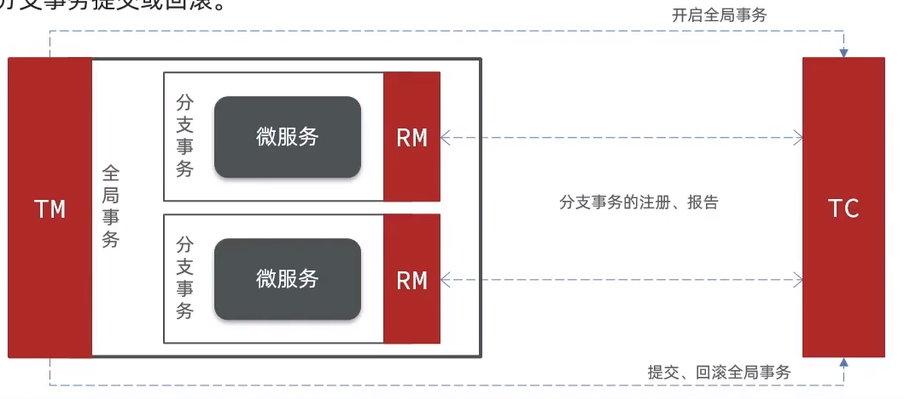

## 环境搭建

### TC服务 - 部署

[下载地址 - Github](https://github.com/seata/seata/releases) 文档对应seata版本为 seata-server-1.4.2

#### 配置修改：

1. 修改conf目录下的 `registry.conf` 文件
   配置文件主要包括 注册中心配置 和 配置中心配置 两部分

   ~~~json
   registry {// 注册信息 支持以下的注册中心 默认为file模式
     // file 、nacos 、eureka、redis、zk、consul、etcd3、sofa
     type = "file"
   
     nacos {
       application = "seata-server" // 当前服务名称 - TC服务的名称
       serverAddr = "127.0.0.1:8848" // nacos地址
       group = "SEATA_GROUP" // 当前服务所在组
       namespace = ""
       cluster = "default" // 集群名称
       username = ""
       password = ""
     }
     eureka {
       serviceUrl = "http://localhost:8761/eureka"
       application = "default"
       weight = "1"
     }...
     file {
       name = "file.conf"
     }
   }
   ~~~

   ~~~json
   config {// 配置信息 支持以下的配置中心 默认为file模式
     // file、nacos 、apollo、zk、consul、etcd3
     type = "file"
   
     nacos {
       serverAddr = "127.0.0.1:8848"
       namespace = ""
       group = "SEATA_GROUP"
       username = ""
       password = ""
       dataId = "seataServer.properties" // 配置id
     }...
     file {
       name = "file.conf"
     }
   }
   ~~~

2. 在对应的配置中心 填写配置文件 [Seata 参数配置 0.9.0版本](https://seata.io/zh-cn/docs/user/configurations090.html)

   ~~~properties
   #数据存储方式，db代表数据库 以下信息是保存Seata运行过程中产生的数据 （支持redis保存）
   store.mode=db
   store.db.datasource=druid
   store.db.dbType=mysql
   store.db.driverClassName=com.mysql.jdbc.Driver
   store.db.url=jdbc :mysql://127.0.0.1:3306/seata?useUnicode=true&rewriteBatchedS tatements=true
   store.db.user=root
   store.db.password=123
   store.db.minConn=5
   store.db.maxConn=30
   # 全局事务表名
   store.db.globalTable=global_table 
   # 分支事务表名
   store.db.branchTable=branch_table
   store.db.queryLimit= 100
   store.db.lockTable=lock_table
   store.db.maxWait= 5000
   ~~~

3. 建立数据库表 （表建立在TC关联数据库中） 参考文件  [脚本文件](script/seata - mysql.sql) || [GitHub 地址](https://github.com/seata/seata/blob/develop/script/server/db/mysql.sql)

   ~~~sql
   -- the table to store GlobalSession data
   CREATE TABLE IF NOT EXISTS `global_table`
   (
       `xid`                       VARCHAR(128) NOT NULL,
       `transaction_id`            BIGINT,
       `status`                    TINYINT      NOT NULL,
       `application_id`            VARCHAR(32),
       `transaction_service_group` VARCHAR(32),
       `transaction_name`          VARCHAR(128),
       `timeout`                   INT,
       `begin_time`                BIGINT,
       `application_data`          VARCHAR(2000),
       `gmt_create`                DATETIME,
       `gmt_modified`              DATETIME,
       PRIMARY KEY (`xid`),
       KEY `idx_status_gmt_modified` (`status` , `gmt_modified`),
       KEY `idx_transaction_id` (`transaction_id`)
   ) ENGINE = InnoDB
     DEFAULT CHARSET = utf8mb4;
   
   -- the table to store BranchSession data
   CREATE TABLE IF NOT EXISTS `branch_table`
   (
       `branch_id`         BIGINT       NOT NULL,
       `xid`               VARCHAR(128) NOT NULL,
       `transaction_id`    BIGINT,
       `resource_group_id` VARCHAR(32),
       `resource_id`       VARCHAR(256),
       `branch_type`       VARCHAR(8),
       `status`            TINYINT,
       `client_id`         VARCHAR(64),
       `application_data`  VARCHAR(2000),
       `gmt_create`        DATETIME(6),
       `gmt_modified`      DATETIME(6),
       PRIMARY KEY (`branch_id`),
       KEY `idx_xid` (`xid`)
   ) ENGINE = InnoDB
     DEFAULT CHARSET = utf8mb4;
   
   -- the table to store lock data
   CREATE TABLE IF NOT EXISTS `lock_table`
   (
       `row_key`        VARCHAR(128) NOT NULL,
       `xid`            VARCHAR(128),
       `transaction_id` BIGINT,
       `branch_id`      BIGINT       NOT NULL,
       `resource_id`    VARCHAR(256),
       `table_name`     VARCHAR(32),
       `pk`             VARCHAR(36),
       `status`         TINYINT      NOT NULL DEFAULT '0' COMMENT '0:locked ,1:rollbacking',
       `gmt_create`     DATETIME,
       `gmt_modified`   DATETIME,
       PRIMARY KEY (`row_key`),
       KEY `idx_status` (`status`),
       KEY `idx_branch_id` (`branch_id`),
       KEY `idx_xid` (`xid`)
   ) ENGINE = InnoDB
     DEFAULT CHARSET = utf8mb4;
   
   CREATE TABLE IF NOT EXISTS `distributed_lock`
   (
       `lock_key`       CHAR(20) NOT NULL,
       `lock_value`     VARCHAR(20) NOT NULL,
       `expire`         BIGINT,
       primary key (`lock_key`)
   ) ENGINE = InnoDB
     DEFAULT CHARSET = utf8mb4;
   
   INSERT INTO `distributed_lock` (lock_key, lock_value, expire) VALUES ('AsyncCommitting', ' ', 0);
   INSERT INTO `distributed_lock` (lock_key, lock_value, expire) VALUES ('RetryCommitting', ' ', 0);
   INSERT INTO `distributed_lock` (lock_key, lock_value, expire) VALUES ('RetryRollbacking', ' ', 0);
   INSERT INTO `distributed_lock` (lock_key, lock_value, expire) VALUES ('TxTimeoutCheck', ' ', 0);
   ~~~

4. 启动TC服务

   ~~~bash
   seata-server.bat
   或
   seata-server.sh
   ~~~

PS：undo_log脚本 AT模式需要使用undo_log表 （表建立在业务数据库中）

~~~sql
CREATE TABLE `undo_log` (
  `id` bigint(20) NOT NULL AUTO_INCREMENT,
  `branch_id` bigint(20) NOT NULL,
  `xid` varchar(100) NOT NULL,
  `context` varchar(128) NOT NULL,
  `rollback_info` longblob NOT NULL,
  `log_status` int(11) NOT NULL,
  `log_created` datetime NOT NULL,
  `log_modified` datetime NOT NULL,
  `ext` varchar(100) DEFAULT NULL,
  PRIMARY KEY (`id`),
  UNIQUE KEY `ux_undo_log` (`xid`,`branch_id`)
) ENGINE=InnoDB AUTO_INCREMENT=1 DEFAULT CHARSET=utf8;
~~~

### 环境依赖

~~~xml
<dependency>
    <groupId>com.alibaba.cloud</groupId>
    <artifactId>spring-cloud-starter-alibaba-seata</artifactId>
</dependency>
~~~

## 解决方案：

### 依赖环境

~~~xml
        <!-- region spring-boot -->
        <dependency>
            <groupId>org.springframework.boot</groupId>
            <artifactId>spring-boot-starter-web</artifactId>
        </dependency>

        <!-- SpringBoot2.4之后不会默认加载bootstrap.yaml 需要添加依赖才行 -->
        <dependency>
            <groupId>org.springframework.cloud</groupId>
            <artifactId>spring-cloud-starter-bootstrap</artifactId>
        </dependency>
        <!-- endregion -->

        <!-- region spring-cloud alibaba-->

        <dependency>
            <groupId>com.alibaba.cloud</groupId>
            <artifactId>spring-cloud-starter-alibaba-nacos-discovery</artifactId>
        </dependency>

        <dependency>
            <groupId>com.alibaba.cloud</groupId>
            <artifactId>spring-cloud-starter-alibaba-nacos-config</artifactId>
        </dependency>

        <dependency>
            <groupId>org.springframework.cloud</groupId>
            <artifactId>spring-cloud-starter-openfeign</artifactId>
        </dependency>
        <dependency>
            <groupId>org.springframework.cloud</groupId>
            <artifactId>spring-cloud-starter-loadbalancer</artifactId>
        </dependency>

        <dependency>
            <groupId>com.alibaba.cloud</groupId>
            <artifactId>spring-cloud-starter-alibaba-sentinel</artifactId>
        </dependency>

        <dependency>
            <groupId>com.alibaba.cloud</groupId>
            <artifactId>spring-cloud-starter-alibaba-seata</artifactId>
        </dependency>
        <!-- endregion -->

        <!-- region tool-->

        <dependency>
            <groupId>cn.vincent</groupId>
            <artifactId>common</artifactId>
            <version>1.0</version>
        </dependency>

        <dependency>
            <groupId>org.projectlombok</groupId>
            <artifactId>lombok</artifactId>
        </dependency>

        <dependency>
            <groupId>cn.hutool</groupId>
            <artifactId>hutool-core</artifactId>
            <version>5.8.15</version>
        </dependency>

        <!-- endregion -->

        <!-- region dataSource -->
        <!-- seata 在使用最新版的mysql驱动器得时候有问题 需要退回到之前的版本 -->
        <dependency>
            <groupId>mysql</groupId>
            <artifactId>mysql-connector-java</artifactId>
            <version>8.0.11</version>
        </dependency>

        <dependency>
            <groupId>com.baomidou</groupId>
            <artifactId>mybatis-plus-boot-starter</artifactId>
            <version>3.5.3.1</version>
        </dependency>

        <dependency>
            <groupId>com.baomidou</groupId>
            <artifactId>mybatis-plus-generator</artifactId>
            <version>3.5.3.1</version>
        </dependency>

        <dependency>
            <groupId>org.springframework.boot</groupId>
            <artifactId>spring-boot-starter-freemarker</artifactId>
        </dependency>
        <!-- endregion -->
~~~

### XA

#### 概念

- 优点：
  - 强一致性
  - 大多数据都支持
    所以seata也只是在数据库接口层面进行了一层封装
  - 实现简单 没有代码侵入
- 缺点：
  - 强一致性导致的性能低下（资源会被上锁）
  - 依赖数据库底层支持（传统关系型数据库没问题 redis之类非关系型数据库不支持XA模式的就不行了）

XA模式将分布式事务定义为两段

1. 一阶段：事务管理器通知资源管理器开始执行业务
   资源管理器返回执行结果（是否成功）

   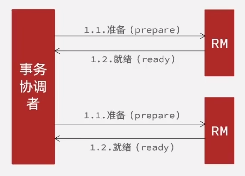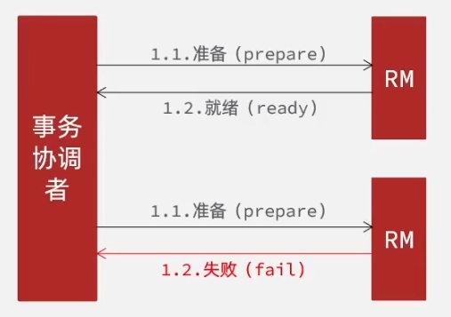

2. 二阶段：事务管理器通过各个资源管理返回的执行结果判断提交或回滚

   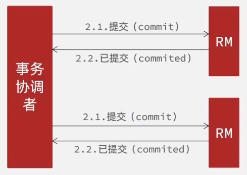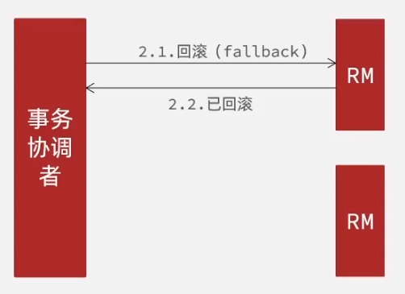

#### Seata XA模型

seata的XA模型做了一些调整 但大体思路是一致的
主要是seata的服务中做了一层RM
RM的主要任务是向TC注册分支事务、报告事务状态（实际的执行、提交、回滚逻辑是数据库来实现）

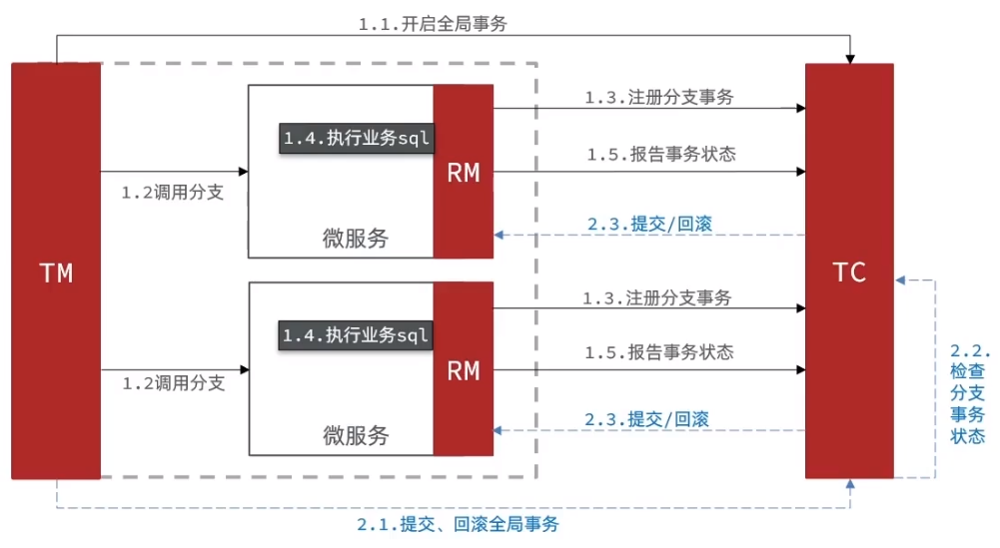

#### 代码实现

1. 配置文件修改

   ~~~yaml
   seata:
     data-source-proxy-mode: XA # 事务模型
     tx-service-group: tc-seata # 事务组
     service:
       vgroup-mapping: # 事务组与cluster的映射关系
         tc-seata: default # 没有设置cluster 所以默认default
     registry: 
       type: nacos # 注册中心类型
       nacos: # 注册中心信息
         namespace: seata
         username: nacos
         password: nacos
         server-addr: 127.0.0.1:8848
   ~~~

   服务成功注册到TC服务中
   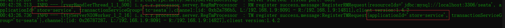
   
2. 通过 `@GlobalTransactional` 注解标注开启全局事务 并在服务提供方抛出异常

   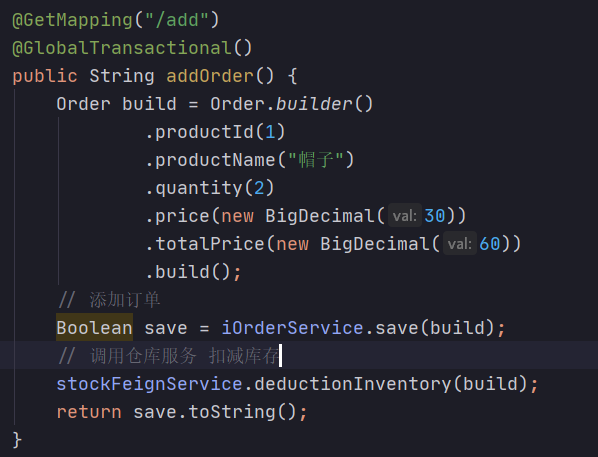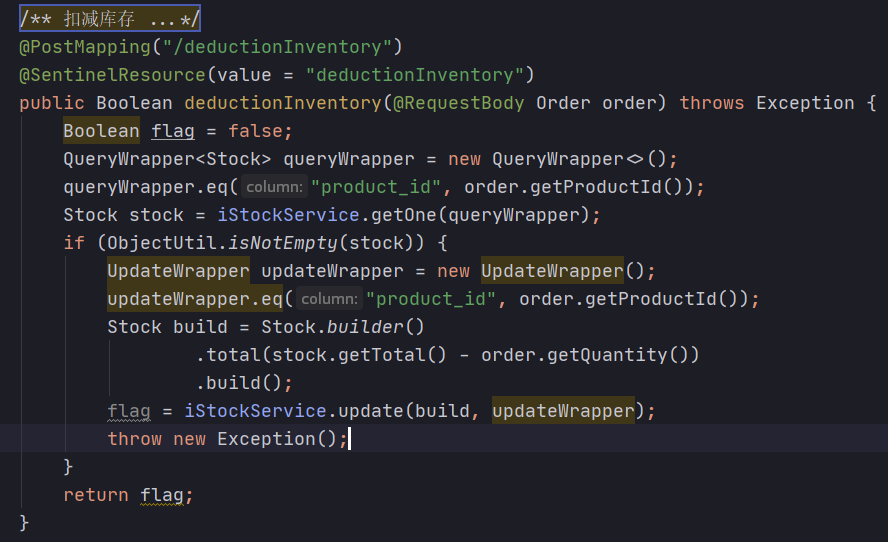
   
3. 观察TC控制台 可以看到输出  Rollback branch transaction successfully
   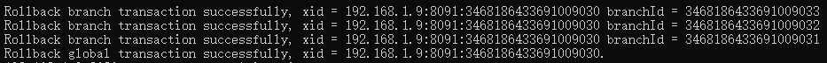

### AT

#### 概念

**AT模式同样是两阶段提交的事务模型** 不过弥补了XA模型中资源锁定周期过长的缺陷

AT模式下 RM管理器中资源会直接提交 不用等待所有资源都提交

- 优点
  - 一阶段直接提交数据库 释放资源 性能较好
  - 利用全局锁实现读写隔离
  - 没有代码侵入 框架自动完成提交、回滚
- 缺点
  - 两阶段之间属于软状态 可能出现脏读问题 追求的是最终一致性
  - 快照功能、全局锁会影响性能 （相比XA模式提高了很多）

#### AT模型

- 一阶段：
  - RM注册分支事务
  - 记录undo-log（数据快照 用于回滚）
  - 执行业务sql并提交
  - 报告事务状态
- 二阶段
  - TM通知TC事务完成 TC检查分支事务状态
    - 分支事务成功 - RM删除log
    - 分支事务失败 - 通过log回滚

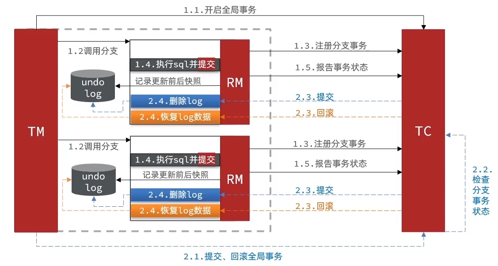

#### XA区别

- XA是追求强一致性  AT是追求结果一致性
- XA在一阶段的时候不提交  AT在一阶段的时候直接提交
- XA的依赖数据库的回滚机制  AT依赖数据快照回滚
- XA模式下 数据库会对操作数据加锁 比较影响效率
  AT模式下 会加一个全局锁 但是全局锁是由TC管理 而不是数据库 且全局锁的粒度更小 影响更小

#### 读写隔离

原因：在数据修改后 因为AT模式是直接提交数据 所以可能在二阶段提交之前 被其他事务修改了数据
而二阶段如果回滚数据 则可能出现脏写的问题 （覆盖事务2的操作 造成数据异常）

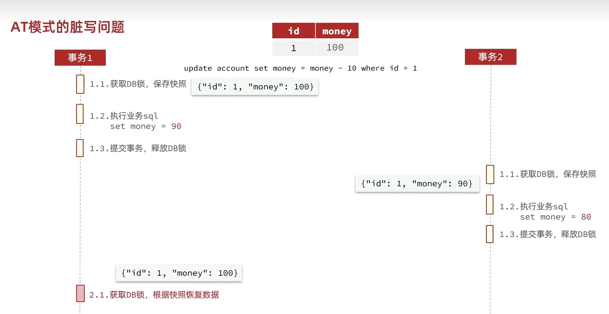

解决方案 - 全局锁：针对上述的脏写问题 seata 提供了全局锁机制 在事务一阶段执行后提交前 需要获取全局锁
在TC中记录当前事务操作的行数据 表明行数据被当前事务所持有

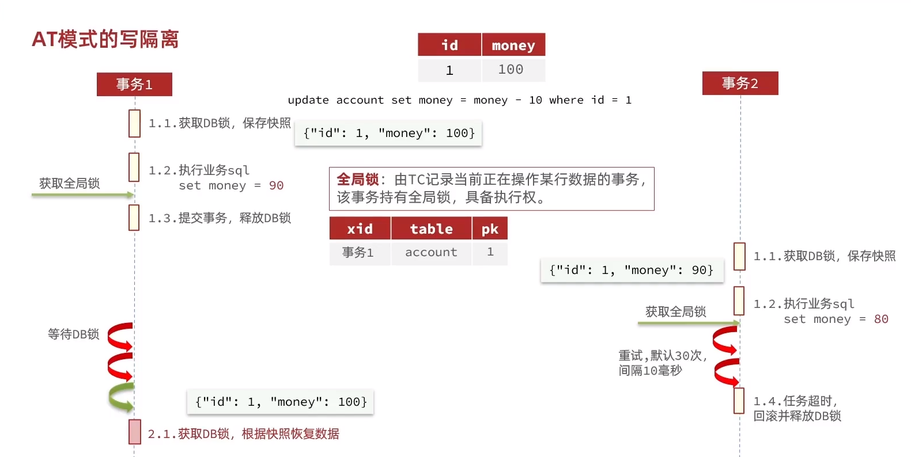

seata管理以外的修改 全局锁无效 所以理论上还是会出现脏写的问题
针对这种情况seata在记录数据快照的时候记录了两份（一份是修改前 | 一份是修改后）
在事务回滚前 对比修改后的数据 如果不相同说明期间数据被其他操作修改了 需要标注异常 发出警告

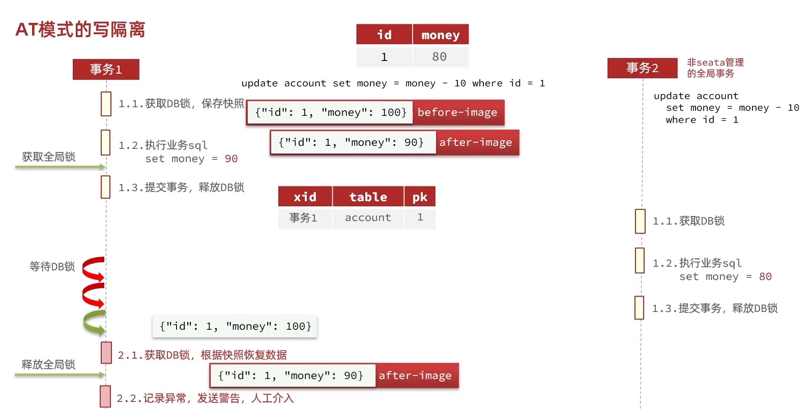

#### 代码实现

基于上面的XA模式实现 AT模式基本不用做改动 修改一下配置文件 并建立undo_log表就可以了

~~~sql
CREATE TABLE `undo_log` (
  `id` bigint(20) NOT NULL AUTO_INCREMENT,
  `branch_id` bigint(20) NOT NULL,
  `xid` varchar(100) NOT NULL,
  `context` varchar(128) NOT NULL,
  `rollback_info` longblob NOT NULL,
  `log_status` int(11) NOT NULL,
  `log_created` datetime NOT NULL,
  `log_modified` datetime NOT NULL,
  `ext` varchar(100) DEFAULT NULL,
  PRIMARY KEY (`id`),
  UNIQUE KEY `ux_undo_log` (`xid`,`branch_id`)
) ENGINE=InnoDB AUTO_INCREMENT=1 DEFAULT CHARSET=utf8;
~~~

校验方法：

在服务提供方主动抛出一个异常
把断点打在服务调用者执行sql语句之后 服务提供方抛出异常之前
在这之间 就可以在数据库中看到数据已经提交
异常抛出后 数据又回滚了 比较简单就不做演示了

### TCC

#### 概念

不需要加锁 与AT模式相似 **每阶段都是独立的事务 直接提交**
不同的是TCC需要通过人工编码来实现数据恢复
需要实现三个方法：

1. Try：资源的检测和预留
2. Confirm：完成资源操作业务 要求try成功confirm一定成功
3. Cancel：预留资源释放 可以理解为try的反向操作

- 优点
  - 一阶段直接提交事务 释放数据资源 性能好
  - 相比AT模式 不生成数据库快照 无需全局锁 性能最强
  - 不依赖数据库事务 而是依赖补偿操作 可以作用于非事务型数据
- 缺点
  - 代码侵入 需要人为编写补偿操作 太麻烦
  - 软状态 事务是最终一致
  - 需要考虑confirm和cancel失败的情况 （失败seata会有重试操作 所以要做幂等处理）
    保证程序的健壮性

#### TCC模型

一阶段的时候 预留出需要操作的资源

二阶段 资源预留成功 提交资源操作（保证操作一定成功）
而极端 资源预留失败 退回预留资源

TCC模式和AT模式一样都是直接提交 不加锁 所以性能高
不过TCC模式没有AT模式的脏读问题 因为他是直接预留了操作资源 

下图是一个TCC模式的示例：

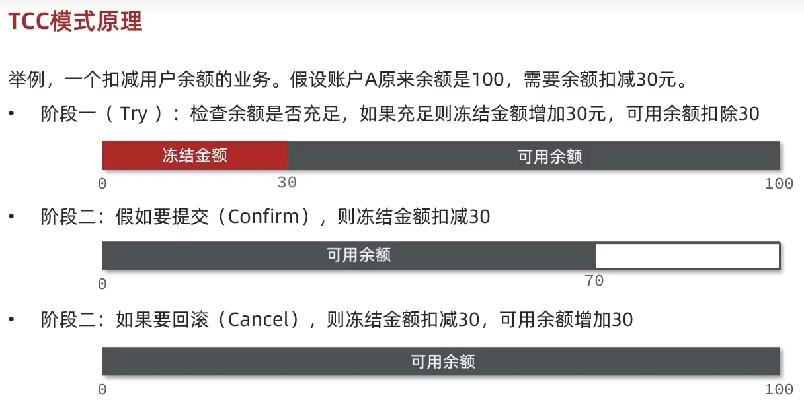

工作模型：

- 一阶段
  - 预留资源：Try
- 二阶段
  - 提交：confirm
  - 回滚：cancel

两段操作都是直接提交

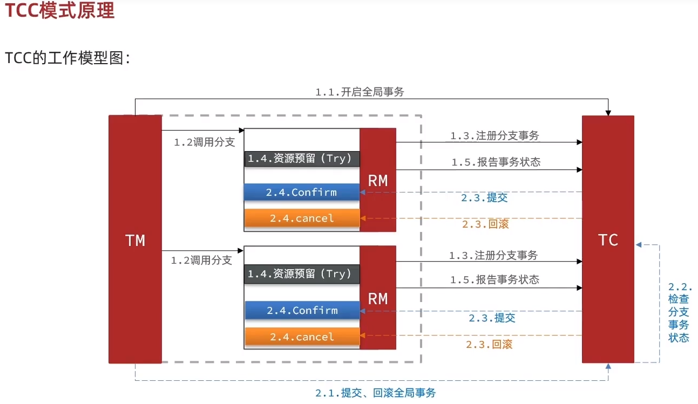

### SAGA

## 核心部份

### @GlobalTransactional

属性

1. name：事务名称，用于区分不同的事务，默认值为全类名加上方法名。
2. timeoutMills：事务超时时间，单位为毫秒，默认值为 -1，表示不设置超时时间。
3. rollbackFor：回滚异常类型数组，表示遇到该数组中的异常类型时，回滚事务。
   默认值为 `{Throwable.class}`，表示遇到任何异常时都回滚事务。
4. noRollbackFor：不回滚异常类型数组，表示遇到该数组中的异常类型时，不回滚事务。
   默认值为空数组，表示遇到任何异常都回滚事务。
5. propagation：事务传播级别 表示事务的传播方式
   默认值为 Propagation.REQUIRED 即当前方法必须运行在事务中
   其他传播级别包括：
   - Propagation.REQUIRES_NEW：当前方法必须运行在新的事务中，如果当前已存在事务，则该事务挂起。
   - Propagation.SUPPORTS：当前方法可以运行在事务中，也可以不运行在事务中。如果当前没有事务，则不开启事务。
   - Propagation.NOT_SUPPORTED：当前方法不运行在事务中，如果当前存在事务，则将事务挂起。
   - Propagation.MANDATORY：当前方法必须运行在事务中，如果当前没有事务，则抛出异常。
   - Propagation.NEVER：当前方法不允许运行在事务中，如果当前存在事务，则抛出异常。
   - Propagation.NESTED：当前方法必须运行在嵌套事务中，如果当前没有事务，则新开启一个嵌套事务。如果已存在事务，则将该事务嵌套在当前事务中。

